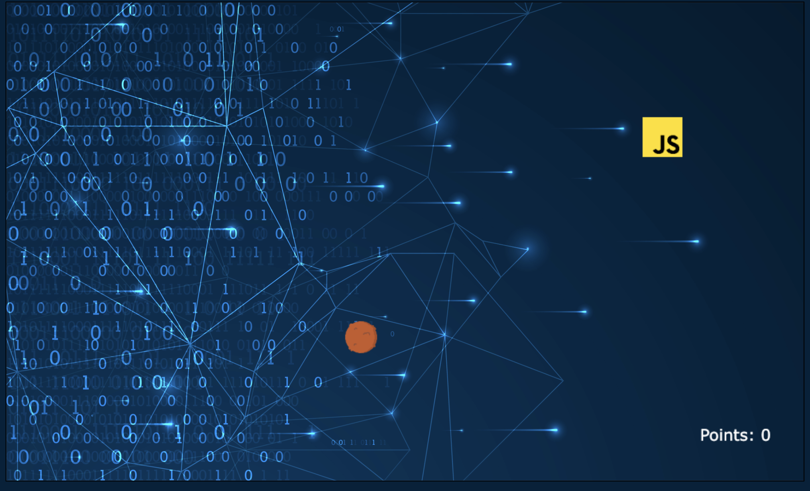

# The Force

<!-- When you finish, add a nice screenshot of your game -->
<!---->

## Description

The Impire try to capture you because you are a Jedi, and you must to scape. You find the extraordinary millennium falcon, but dosen't work, so you have to use the force for move 
spacecraft and shoot... but... do you can really shoot another one?

/If you kill a cockroach you are a hero. If you kill a butterfly you are bad. Morality has aesthetic standards/

- Friedrich Nietzsche

## User stories MVP

Minimum user stories:

- User can ...

## User stories Backlog

- User can ...

## File structure

- <code>game.js</code>: contains all the elements for the game to work. Methods: start(), \_update()
- <code>scripts.js</code>: contains all the DOM manipulation code to start the game

## Useful links

<!-- When you finish, add these links and commit -->

- [Presentation slides]()
- [Deployed game]()
