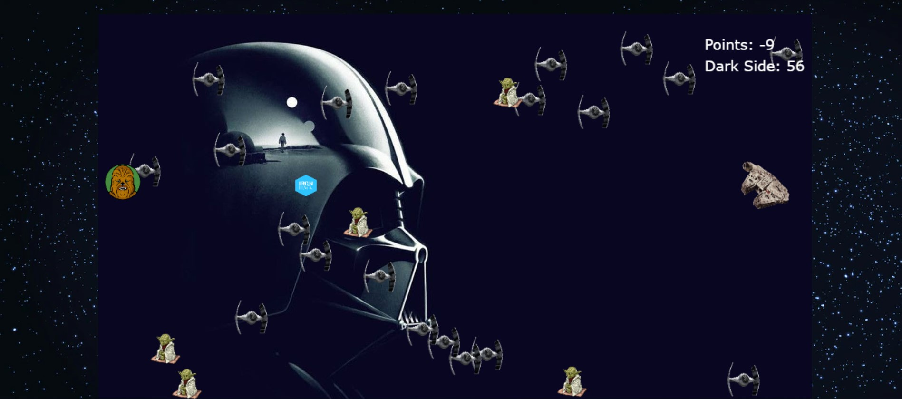

# The Force

## Description

The Impire try to capture you because you are a Jedi, and you must to scape. You find the extraordinary millennium falcon, but dosen't work, so you have to use the force to move 
spacecraft and shoot... but... Do you can really shoot another one? Your moral code say no, but you have some feelings that say another things...

If you crush a cockroach, you're a hero. If you crush a beautiful butterfly, you're a villain. Morals have aesthetic criteria.

- Friedrich Nietzsche

The greatest victory is that which requires no battle.

- Sun Tzu, The Art of War

## User stories MVP

Minimum user stories:

- User can see a start screen with instructions and controls, win and loose screen.
- User can see the player to the right, moving up and down with the key arrows.
- User can see the blue bullets that they can shoot.
- User can see the enemies and allies, appearing from the left, going to the right.
- User can see when have a collision with an ally take 1 point. 
- User can see when they shoot a enemy, the Dark Side it grows, and when they shoot allies, it's 1 point less.
- User can win when takes 10 allies, and loose when have only 1 collision with one enemy.

## User stories Backlog

- Kill it's not necessary to win.
- The shoot it's very strong, so the user have to take care to not kill allies.
- The shoot it's a moral code, the user can do it or not.
- User must to dodge if they not wanna shoot. That's it's the only and real way to win.
- Collision between a bullet and an enemy plays a sound effect.
- Collision between player and an enemy plays a sound effect.
- Collision between player and an ally plays a sound effect.
- The Game page plays a background Music.
- The Win page plays a background Music.
- The Loose page plays a background Music.

## File structure

- <code>index.html</code>: contains the game basic HTML structure
- <code>game.js</code>: contains all the elements for the game to work Methods: start(), \_update()
- <code>scripts.js</code>: contains all the DOM manipulation code to start the game
- <code>assets.js</code>: contains all the media needed for the game (images, sounds, etc)
- <code>player.js</code>: contains the player class and methods
- <code>characters.js</code>: contains the allies and enemies
- <code>bullets.js</code>: contains the bullet class and methods
- <code>img folfer</code>: contains all the game images
- <code>audio folfer</code>: contains all the game sound effects and music
- <code>style.css</code>: contains the game visual design elements

## Useful links

<!-- When you finish, add these links and commit -->

- [Presentation slides](https://slides.com/ricardmontfortromero/code#/8)
- [Deployed game](https://ricardmontfort90.github.io/The-Force/)
